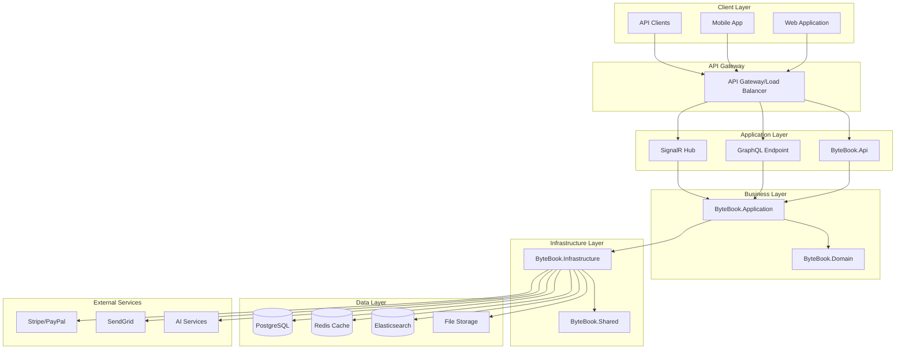

# ByteBook Platform Design Document

## Overview

ByteBook is a digital publishing platform built using Clean Architecture principles with .NET 9. The platform enables flexible content monetization through pay-per-page and pay-per-hour models while providing comprehensive content protection, analytics, and user management capabilities.

The system is designed to handle high-volume content delivery, real-time payment processing, and sophisticated content protection mechanisms while maintaining excellent performance and user experience across web and mobile platforms.

## Architecture

### High-Level Architecture



### Clean Architecture Layers

#### 1. Domain Layer (ByteBook.Domain)
- **Entities**: Core business objects (User, Book, Payment, Reading, etc.)
- **Value Objects**: Immutable objects (Email, Money, UserProfile, etc.)
- **Domain Events**: Business events (UserRegistered, BookPublished, etc.)
- **Exceptions**: Domain-specific exceptions
- **Interfaces**: Repository and service contracts

#### 2. Application Layer (ByteBook.Application)
- **Use Cases**: Business logic implementation
- **DTOs**: Data transfer objects for API communication
- **Interfaces**: Application service contracts
- **Behaviors**: Cross-cutting concerns (validation, logging, caching)
- **Features**: Organized by business capabilities

#### 3. Infrastructure Layer (ByteBook.Infrastructure)
- **Persistence**: Entity Framework configurations and repositories
- **External Services**: Payment processors, email services, file storage
- **Identity**: Authentication and authorization implementation
- **Messaging**: Event handling and notifications
- **Configurations**: Service registrations and settings

#### 4. API Layer (ByteBook.Api)
- **Controllers**: REST API endpoints
- **GraphQL**: Query and mutation resolvers
- **Middlewares**: Request/response processing
- **Filters**: Cross-cutting concerns
- **SignalR Hubs**: Real-time communication

#### 5. Shared Layer (ByteBook.Shared)
- **Constants**: Application-wide constants
- **Results**: Common response patterns
- **Utils**: Utility functions and helpers
- **Middleware**: Reusable middleware components

## Components and Interfaces

### Core Domain Entities

#### User Entity
```csharp
public class User : BaseEntity
{
    // Properties: FirstName, LastName, Email, PasswordHash, Role, Profile
    // Methods: VerifyEmail, ResetPassword, UpdateProfile, Activate/Deactivate
    // Navigation: AuthoredBooks, Payments, Referrals, Readings
}
```

#### Book Entity
```csharp
public class Book : BaseEntity
{
    // Properties: Title, Description, Content, AuthorId, Category, Status
    // Methods: Publish, UpdatePricing, AddChapter, SetVisibility
    // Navigation: Author, Chapters, Payments, Reviews, Analytics
}
```

#### Payment Entity
```csharp
public class Payment : BaseEntity
{
    // Properties: UserId, BookId, Amount, PaymentType, Status, Provider
    // Methods: Process, Refund, MarkComplete, CalculateAuthorEarnings
    // Navigation: User, Book, PaymentDetails
}
```

#### Reading Entity
```csharp
public class Reading : BaseEntity
{
    // Properties: UserId, BookId, StartTime, EndTime, PagesRead, TimeSpent
    // Methods: StartSession, EndSession, CalculateCharges, UpdateProgress
    // Navigation: User, Book, ReadingProgress
}
```

### Value Objects

#### Email Value Object
```csharp
public class Email : ValueObject
{
    public string Value { get; private set; }
    // Validation: RFC 5322 compliant email validation
}
```

#### Money Value Object
```csharp
public class Money : ValueObject
{
    public decimal Amount { get; private set; }
    public string Currency { get; private set; }
    // Methods: Add, Subtract, Multiply, ConvertTo
}
```

#### UserProfile Value Object
```csharp
public class UserProfile : ValueObject
{
    public string Bio { get; private set; }
    public string Avatar { get; private set; }
    public string Website { get; private set; }
    public Dictionary<string, string> SocialLinks { get; private set; }
}
```

### Application Services

#### Authentication Service
```csharp
public interface IAuthenticationService
{
    Task<AuthResult> RegisterAsync(RegisterUserDto dto);
    Task<AuthResult> LoginAsync(LoginDto dto);
    Task<AuthResult> RefreshTokenAsync(string refreshToken);
    Task<bool> VerifyEmailAsync(string token);
    Task<bool> ResetPasswordAsync(ResetPasswordDto dto);
}
```

#### Book Management Service
```csharp
public interface IBookService
{
    Task<BookDto> CreateBookAsync(CreateBookDto dto);
    Task<BookDto> UpdateBookAsync(int bookId, UpdateBookDto dto);
    Task<bool> PublishBookAsync(int bookId);
    Task<PageContentDto> GetPageContentAsync(int bookId, int pageNumber, int userId);
    Task<BookAnalyticsDto> GetBookAnalyticsAsync(int bookId, int authorId);
}
```

#### Payment Processing Service
```csharp
public interface IPaymentService
{
    Task<PaymentResult> ProcessPaymentAsync(PaymentRequest request);
    Task<RefundResult> ProcessRefundAsync(int paymentId, decimal amount);
    Task<decimal> CalculateChargesAsync(int userId, int bookId, ReadingSession session);
    Task<AuthorEarningsDto> GetAuthorEarningsAsync(int authorId, DateRange period);
}
```

#### Content Protection Service
```csharp
public interface IContentProtectionService
{
    Task<string> ApplyWatermarkAsync(string content, int userId);
    Task<bool> ValidateContentAccessAsync(int userId, int bookId, int pageNumber);
    Task<string> GenerateSecureContentUrlAsync(int bookId, int pageNumber, int userId);
    Task LogSuspiciousActivityAsync(int userId, string activity, string details);
}
```

### Infrastructure Services

#### Repository Pattern
```csharp
public interface IRepository<T> where T : BaseEntity
{
    Task<T?> GetByIdAsync(int id);
    Task<IEnumerable<T>> GetAllAsync();
    Task<T> AddAsync(T entity);
    Task UpdateAsync(T entity);
    Task DeleteAsync(int id);
    Task<bool> ExistsAsync(int id);
}

public interface IUserRepository : IRepository<User>
{
    Task<User?> GetByEmailAsync(string email);
    Task<User?> GetByVerificationTokenAsync(string token);
    Task<User?> GetByResetTokenAsync(string token);
}

public interface IBookRepository : IRepository<Book>
{
    Task<IEnumerable<Book>> GetByAuthorAsync(int authorId);
    Task<IEnumerable<Book>> SearchAsync(string query, BookFilters filters);
    Task<Book?> GetWithChaptersAsync(int bookId);
}
```

#### External Service Integrations
```csharp
public interface IPaymentProcessor
{
    Task<PaymentResult> ProcessPaymentAsync(PaymentRequest request);
    Task<RefundResult> ProcessRefundAsync(string paymentId, decimal amount);
    Task<WebhookResult> HandleWebhookAsync(string payload, string signature);
}

public interface IEmailService
{
    Task SendEmailVerificationAsync(string email, string token);
    Task SendPasswordResetAsync(string email, string token);
    Task SendPaymentConfirmationAsync(string email, PaymentDetails details);
}

public interface IFileStorageService
{
    Task<string> UploadFileAsync(Stream fileStream, string fileName, string contentType);
    Task<Stream> DownloadFileAsync(string fileUrl);
    Task<bool> DeleteFileAsync(string fileUrl);
    Task<string> GeneratePresignedUrlAsync(string fileUrl, TimeSpan expiry);
}
```

## Data Models

### Database Schema Design

#### Users Table
```sql
CREATE TABLE Users (
    Id SERIAL PRIMARY KEY,
    FirstName VARCHAR(100) NOT NULL,
    LastName VARCHAR(100) NOT NULL,
    Email VARCHAR(255) UNIQUE NOT NULL,
    PasswordHash VARCHAR(255) NOT NULL,
    Role INTEGER NOT NULL DEFAULT 1,
    ProfileJson JSONB,
    IsEmailVerified BOOLEAN DEFAULT FALSE,
    EmailVerifiedAt TIMESTAMP,
    EmailVerificationToken VARCHAR(255),
    ResetPasswordToken VARCHAR(255),
    ResetPasswordTokenExpiry TIMESTAMP,
    IsActive BOOLEAN DEFAULT TRUE,
    LastLoginAt TIMESTAMP,
    CreatedAt TIMESTAMP DEFAULT NOW(),
    UpdatedAt TIMESTAMP DEFAULT NOW()
);
```

#### Books Table
```sql
CREATE TABLE Books (
    Id SERIAL PRIMARY KEY,
    Title VARCHAR(500) NOT NULL,
    Description TEXT,
    AuthorId INTEGER REFERENCES Users(Id),
    Category VARCHAR(100),
    Status INTEGER DEFAULT 1,
    ContentUrl VARCHAR(1000),
    CoverImageUrl VARCHAR(1000),
    TotalPages INTEGER DEFAULT 0,
    PricePerPage DECIMAL(10,4),
    PricePerHour DECIMAL(10,2),
    IsPublished BOOLEAN DEFAULT FALSE,
    PublishedAt TIMESTAMP,
    CreatedAt TIMESTAMP DEFAULT NOW(),
    UpdatedAt TIMESTAMP DEFAULT NOW()
);
```

#### Payments Table
```sql
CREATE TABLE Payments (
    Id SERIAL PRIMARY KEY,
    UserId INTEGER REFERENCES Users(Id),
    BookId INTEGER REFERENCES Books(Id),
    Amount DECIMAL(10,2) NOT NULL,
    Currency VARCHAR(3) DEFAULT 'USD',
    PaymentType INTEGER NOT NULL, -- 1: PerPage, 2: PerHour
    Status INTEGER DEFAULT 1, -- 1: Pending, 2: Completed, 3: Failed, 4: Refunded
    Provider VARCHAR(50), -- Stripe, PayPal, MPesa
    ExternalTransactionId VARCHAR(255),
    ProcessedAt TIMESTAMP,
    CreatedAt TIMESTAMP DEFAULT NOW()
);
```

#### Readings Table
```sql
CREATE TABLE Readings (
    Id SERIAL PRIMARY KEY,
    UserId INTEGER REFERENCES Users(Id),
    BookId INTEGER REFERENCES Books(Id),
    StartTime TIMESTAMP NOT NULL,
    EndTime TIMESTAMP,
    PagesRead INTEGER DEFAULT 0,
    TimeSpentMinutes INTEGER DEFAULT 0,
    LastPageRead INTEGER DEFAULT 0,
    IsCompleted BOOLEAN DEFAULT FALSE,
    CreatedAt TIMESTAMP DEFAULT NOW(),
    UpdatedAt TIMESTAMP DEFAULT NOW()
);
```

### Elasticsearch Schema

#### Books Index
```json
{
  "mappings": {
    "properties": {
      "id": { "type": "integer" },
      "title": { 
        "type": "text", 
        "analyzer": "standard",
        "fields": {
          "keyword": { "type": "keyword" }
        }
      },
      "description": { "type": "text" },
      "author": {
        "properties": {
          "id": { "type": "integer" },
          "name": { "type": "text" },
          "verified": { "type": "boolean" }
        }
      },
      "category": { "type": "keyword" },
      "tags": { "type": "keyword" },
      "content": { "type": "text" },
      "pricing": {
        "properties": {
          "perPage": { "type": "float" },
          "perHour": { "type": "float" }
        }
      },
      "ratings": {
        "properties": {
          "average": { "type": "float" },
          "count": { "type": "integer" }
        }
      },
      "publishedAt": { "type": "date" },
      "popularity": { "type": "float" }
    }
  }
}
```

## Error Handling

### Exception Hierarchy
```csharp
public abstract class ByteBookException : Exception
{
    public string ErrorCode { get; }
    public object? Details { get; }
    
    protected ByteBookException(string errorCode, string message, object? details = null) 
        : base(message)
    {
        ErrorCode = errorCode;
        Details = details;
    }
}

public class ValidationException : ByteBookException
{
    public ValidationException(string message, Dictionary<string, string[]> errors)
        : base("VALIDATION_ERROR", message, errors) { }
}

public class AuthenticationException : ByteBookException
{
    public AuthenticationException(string message)
        : base("AUTH_ERROR", message) { }
}

public class PaymentException : ByteBookException
{
    public PaymentException(string message, string? transactionId = null)
        : base("PAYMENT_ERROR", message, new { TransactionId = transactionId }) { }
}

public class ContentAccessException : ByteBookException
{
    public ContentAccessException(string message, int bookId, int userId)
        : base("ACCESS_DENIED", message, new { BookId = bookId, UserId = userId }) { }
}
```

### Global Error Handling Middleware
```csharp
public class GlobalExceptionMiddleware
{
    public async Task InvokeAsync(HttpContext context, RequestDelegate next)
    {
        try
        {
            await next(context);
        }
        catch (Exception ex)
        {
            await HandleExceptionAsync(context, ex);
        }
    }
    
    private async Task HandleExceptionAsync(HttpContext context, Exception exception)
    {
        var response = exception switch
        {
            ValidationException validationEx => CreateErrorResponse(400, validationEx),
            AuthenticationException authEx => CreateErrorResponse(401, authEx),
            ContentAccessException accessEx => CreateErrorResponse(403, accessEx),
            PaymentException paymentEx => CreateErrorResponse(402, paymentEx),
            _ => CreateErrorResponse(500, new ByteBookException("INTERNAL_ERROR", "An unexpected error occurred"))
        };
        
        context.Response.StatusCode = response.StatusCode;
        await context.Response.WriteAsync(JsonSerializer.Serialize(response));
    }
}
```

## Testing Strategy

### Unit Testing
- **Domain Layer**: Test entity business logic, value object validation, domain events
- **Application Layer**: Test use cases, service implementations, validation behaviors
- **Infrastructure Layer**: Test repository implementations, external service integrations

### Integration Testing
- **API Endpoints**: Test complete request/response cycles
- **Database Operations**: Test Entity Framework configurations and queries
- **External Services**: Test payment processing, email sending, file storage

### End-to-End Testing
- **User Journeys**: Test complete user workflows from registration to content consumption
- **Payment Flows**: Test complete payment processing including webhooks
- **Content Protection**: Test DRM and access control mechanisms

### Performance Testing
- **Load Testing**: Test system under expected user loads
- **Stress Testing**: Test system limits and failure modes
- **Content Delivery**: Test page loading and streaming performance

## Security Considerations

### Authentication & Authorization
- JWT tokens with short expiry (1 hour) and refresh tokens (7 days)
- Role-based access control (RBAC) with granular permissions
- OAuth 2.0 integration for social login
- Multi-factor authentication for sensitive operations

### Content Protection
- DRM implementation with encrypted content delivery
- User-specific watermarking on all content
- Screenshot prevention using browser APIs
- Session-based access tokens with time limits

### Data Protection
- AES-256 encryption for sensitive data at rest
- TLS 1.3 for all data in transit
- GDPR compliance with data portability and deletion
- Regular security audits and penetration testing

### API Security
- Rate limiting to prevent abuse
- Input validation and sanitization
- CORS configuration for web clients
- API key management for external integrations

This design provides a comprehensive foundation for building the ByteBook platform while maintaining clean architecture principles, scalability, and security best practices.